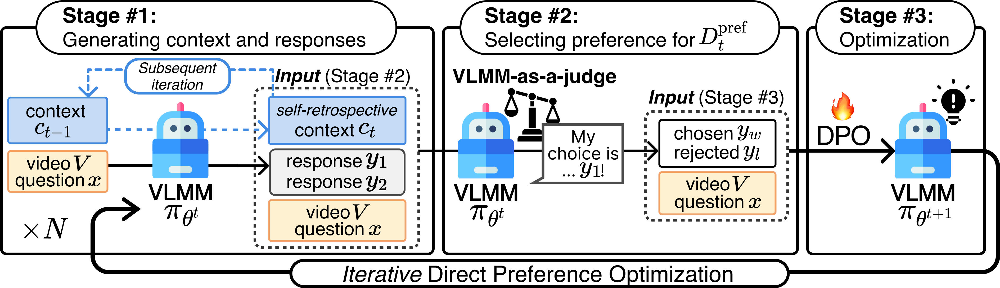

# ISR-DPO (AAAI'25)
> [**ISR-DPO:Aligning Large Multimodal Models for Videos by Iterative Self-Retrospective DPO**](https://arxiv.org/abs/2406.11280v2),            
[Daechul Ahn*](https://dcahn12.github.io)<sup>1</sup>,
[Yura Choi*](https://yuuraa.github.io)<sup>1,2</sup>,
San Kim<sup>1</sup>,
[Youngjae Yu](https://yj-yu.github.io/home/)<sup>2</sup>, 
[Dongyeop Kang](https://dykang.github.io)<sup>3</sup>,
[Jonghyun Choi](https://ppolon.github.io)<sup>1,&dagger;</sup>(*Equal Contribution)<br>
<sup>1</sup>Seoul National University,
<sup>2</sup>Yonsei University,
<sup>3</sup>University of Minnesota<br>
<sup>&dagger;</sup>Corresponding Author<br>

[](https://huggingface.co/SNUMPR/isrt_video_llava_7b_9th)
[](https://arxiv.org/pdf/2406.11280v1)

> **Abstract:** *Iterative self-improvement, a concept extending beyond personal growth, has found powerful applications in machine learning, particularly in transforming weak models into strong ones. While recent advances in natural language processing have shown its efficacy through iterative preference optimization, applying this approach to Video Large Multimodal Models (VLMMs) remains challenging due to modality misalignment. VLMMs struggle with this misalignment during iterative preference modeling, as the self-judge model often prioritizes linguistic knowledge over visual information. Additionally, iterative preference optimization can lead to visually hallucinated verbose responses due to length bias within the self-rewarding cycle. To address these issues, we propose Iterative Self-Retrospective Direct Preference Optimization (ISR-DPO), a method that uses self-retrospection to enhance preference modeling. This approach enhances the self-judge's focus on informative video regions, resulting in more visually grounded preferences. In extensive empirical evaluations across dieverse video question answering benchmarks, the ISR-DPO significantly outperforms the state of the art.*

<!-- ## Approach -->


## Release
- [12/10] Our paper is accepted to AAAI 2025!
- [07/02] Upload model checkpoint & evaluation code
- [06/17] Create repository, update README


## Evaluation
### Prepare evaluation dataset
- using the script from [LLaVA-Hound-DPO](https://github.com/RifleZhang/LLaVA-Hound-DPO)
    ```
    TEST_VIDEO_DIR=YOUR_PATH bash setup/setup_test_data.sh
    ```
- or, download manually from this [link](https://huggingface.co/datasets/ShareGPTVideo/test_video_and_instruction/tree/main)

### Evaluating the model 
    # out-domain video question answering
    bash Evaluation/pipeline/outdomain_test_pipeline.sh \
        results \
        SNUMPR/isrt_video_llava_7b_9th


## Building Preference Data w/ Model
- Coming soon

## Training
- Coming soon

## License
GNU GENERAL PUBLIC LICENSE

## Acknowledgement
- [LLaVA-Hound-DPO](https://github.com/RifleZhang/LLaVA-Hound-DPO): Our code is built upon the codebase from LLaVA-Hound-DPO
